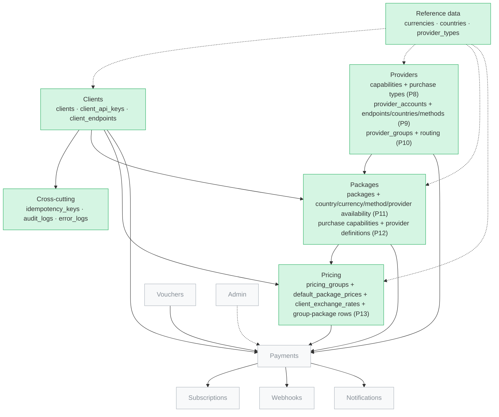
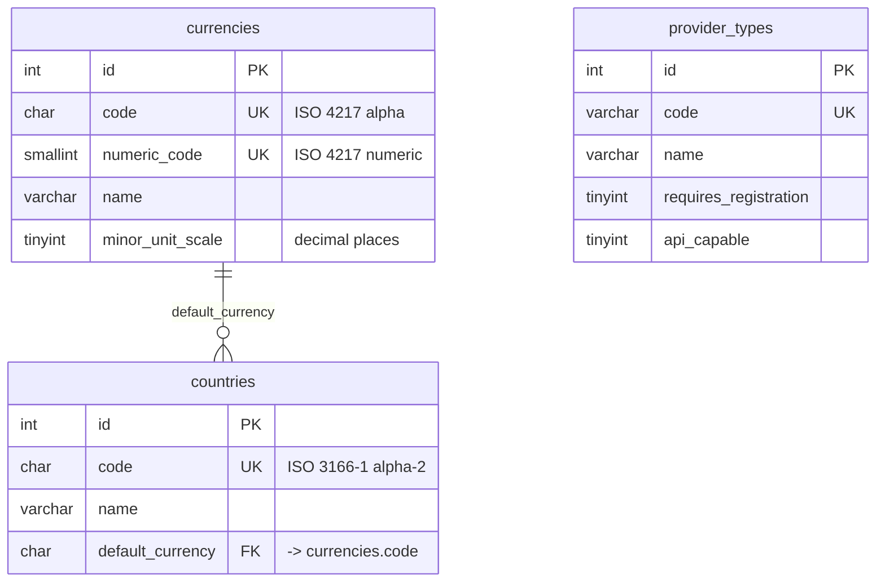
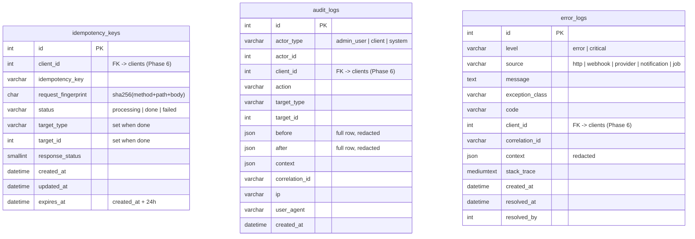
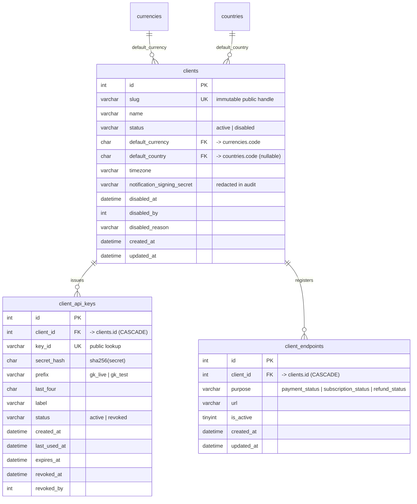
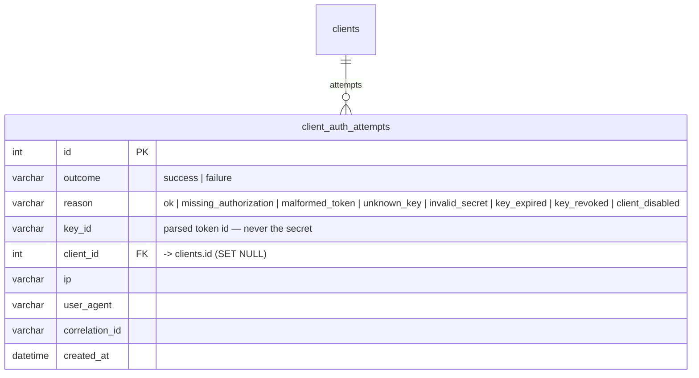
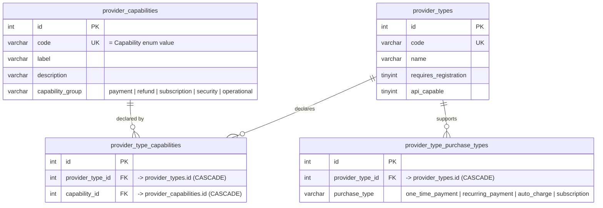
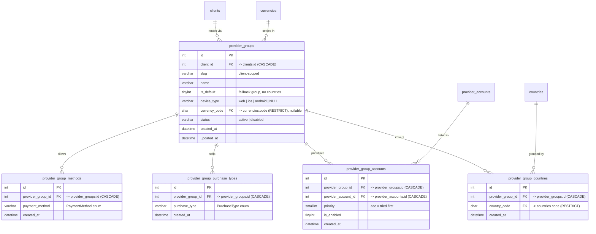
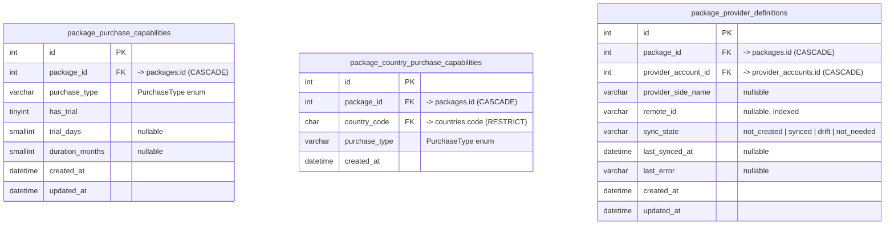
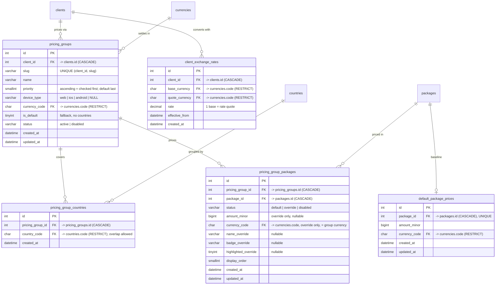

# Database diagram

Mermaid ER diagrams, grouped by module, plus the module map. **Living document** — kept in
lock-step with `database-design.md` and `db_explain.md` (`.claude/Rule.md` §5). The standalone
page `database-diagram.html` reads the Mermaid blocks from this file when served over HTTP.

## Module map

Green = tables exist. Grey = designed in that module's phase.

## Reference data (Phase 4)

`provider_types` has no relationships yet — the capability tables that will reference it are
Phase 8.

## Cross-cutting (Phase 5)

The `client_id` foreign keys were added in Phase 6 (`AddClientFksToCrossCuttingTables`):
`idempotency_keys` → CASCADE, `audit_logs` / `error_logs` → SET NULL.
`uniq_idempotency_keys_client_key (client_id, idempotency_key)` enforces one key per client.

## Clients (Phase 6)

`UNIQUE (client_id, purpose)` on `client_endpoints` — one active URL per purpose.

## Client API authentication (Phase 7)

Append-only. Written best-effort by `ApiKeyAuthenticator` on every `/api/v1` auth attempt. No
schema change to `client_api_keys` — `last_used_at` is now stamped (throttled ≤ 1/key/5 min).

## Providers (Phase 8)

Seeded for **stripe + paypal** only (Phase 8 Q5); ziraat / mollie capability rows land in their
adapter phases. `provider_capabilities` is a seeded mirror of the `Capability` enum. Payment
methods are **not** modelled at the type level (Q4).

## Providers — accounts (Phase 9)

Secret keys are encrypted with `Shared\Application\SecretCipher` (`SodiumSecretCipher`, key from
`APP_ENCRYPTION_KEY`). Account-level capability narrowing is **not** modelled — inherited from
the provider type (Phase 9 Q4). `local-dev` gets a seeded `stripe/test` account
(`APP_ENV ∈ {local, testing}` only).

## Providers — routing (Phase 10)

Provider groups are the **only** country→provider mechanism (Phase 10 Q1 — no
`country_provider_configs` tables). `ProviderRouter` resolves the group for a request, then
filters the ordered accounts by mode / status / served country / purchase type (group set ∩
provider-type declaration) / method, and returns an in-memory `RoutingDecision` (ordered
candidates + rejections). Unsupported combinations are **rejected, never downgraded**. No
routing snapshot table this phase (Q4). `local-dev` gets seeded `turkey` / `germany` /
`netherlands` / `default` groups (`APP_ENV ∈ {local, testing}` only).

## Packages — catalog & availability (Phase 11)

Client-owned catalogue (one `packages` table with `client_id`, `code` unique per client — no
global catalogue, no `client_packages` junction). Each of the four availability dimensions is
**fail open**: an empty set = available everywhere for that dimension (Phase 11 Q2); rows
restrict. A package's **purchase types** (Phase 12) are stored in `package_purchase_capabilities`
(fail **closed** — no rows = not sellable) with per-type trial / duration; a
`package_country_purchase_capabilities` override **replaces** the global set for one country.
`PackageCatalog::resolve(client, country, currency, ?method)` returns the active, market-matching
**sellable** packages with provider accounts narrowed to the client's active set and the
country-effective purchase capabilities. `package_provider_definitions` tracks where a package
exists on each provider account (`sync_state` 4-state machine; editing a package flips `synced` →
`drift`). **No price yet — Phase 13.** `local-dev` seeds `starter` (one-time) + `pro`
(one-time + subscription, 7-day trial) (`APP_ENV ∈ {local, testing}` only).

## Pricing — groups & default prices (Phase 13)

Priority-ordered country grouping (overlap allowed — lowest `priority` wins; `is_default` last).
`default_package_prices` is the one baseline per package; a `status=default` group-package in a
different currency converts via `client_exchange_rates` (the latest effective row).
`status=override` carries its own amount in the group currency; `status=disabled` hides the
package in that group; no row = implicit `default`. `PriceResolver` / `PriceCatalog` produce a
`ResolvedPrice` (`baseline` / `converted` / `group_override`); `GET /api/v1/packages` and
`GET /api/v1/pricing/resolve` mount this phase. `local-dev` seeds `default` (EUR) / `dach`
(DE/AT/CH, EUR, `pro` overridden €24) / `us` (USD, converted) groups + an EUR→USD rate.
