# Database diagram

Mermaid ER diagrams, grouped by module, plus the module map. **Living document** — kept in
lock-step with `database-design.md` and `db_explain.md` (`.claude/Rule.md` §5). The standalone
page `database-diagram.html` reads the Mermaid blocks from this file when served over HTTP.

## Module map

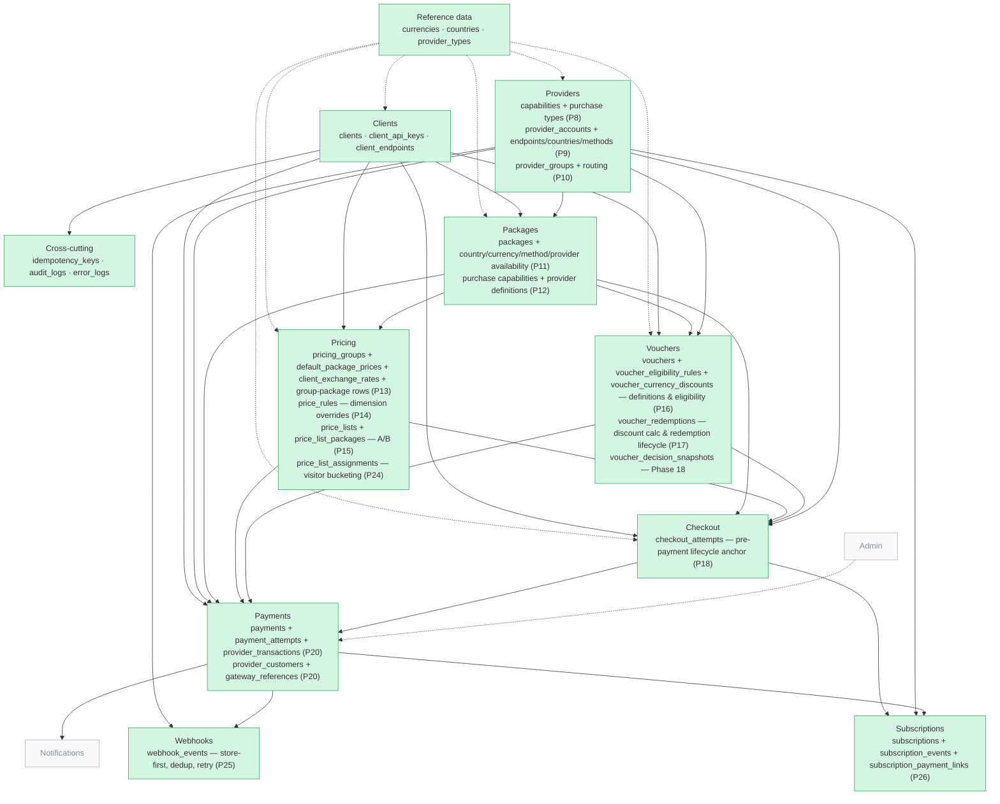
```mermaid
flowchart TD
    Ref["Reference data<br/>currencies · countries · provider_types"]
    Xc["Cross-cutting<br/>idempotency_keys · audit_logs · error_logs"]
    Clients["Clients<br/>clients · client_api_keys · client_endpoints"]
    Providers["Providers<br/>capabilities + purchase types (P8)<br/>provider_accounts + endpoints/countries/methods (P9)<br/>provider_groups + routing (P10)"]
    Packages["Packages<br/>packages + country/currency/method/provider availability (P11)<br/>purchase capabilities + provider definitions (P12)"]
    Pricing["Pricing<br/>pricing_groups + default_package_prices + client_exchange_rates + group-package rows (P13)<br/>price_rules — dimension overrides (P14)<br/>price_lists + price_list_packages — A/B (P15)<br/>price_list_assignments — visitor bucketing (P24)"]
    Vouchers["Vouchers<br/>vouchers + voucher_eligibility_rules + voucher_currency_discounts — definitions & eligibility (P16)<br/>voucher_redemptions — discount calc & redemption lifecycle (P17)<br/>voucher_decision_snapshots — Phase 18"]
    Checkout["Checkout<br/>checkout_attempts — pre-payment lifecycle anchor (P18)"]
    Payments["Payments<br/>payments + payment_attempts + provider_transactions (P20)<br/>provider_customers + gateway_references (P20)"]
    Webhooks["Webhooks<br/>webhook_events — store-first, dedup, retry (P25)"]
    Subscriptions["Subscriptions<br/>subscriptions + subscription_events + subscription_payment_links (P26)"]
    Ref -.-> Clients
    Ref -.-> Providers
    Ref -.-> Packages
    Ref -.-> Pricing
    Ref -.-> Vouchers
    Ref -.-> Checkout
    Clients --> Xc
    Clients --> Packages
    Providers --> Packages
    Clients --> Pricing
    Packages --> Pricing
    Clients --> Vouchers
    Packages --> Vouchers
    Providers --> Vouchers
    Clients --> Checkout
    Packages --> Checkout
    Pricing --> Checkout
    Vouchers --> Checkout
    Providers --> Checkout
    Clients --> Payments
    Providers --> Payments
    Packages --> Payments
    Pricing --> Payments
    Vouchers --> Payments
    Checkout --> Payments
    Providers --> Webhooks
    Payments --> Webhooks
    Checkout --> Subscriptions
    Providers --> Subscriptions
    Payments --> Subscriptions
    Payments --> Notifications
    Admin -.-> Payments

    classDef done fill:#d5f5e3,stroke:#27ae60;
    classDef todo fill:#f8f9fa,stroke:#adb5bd,color:#868e96;
    class Ref,Xc,Clients,Providers,Packages,Pricing,Vouchers,Checkout,Payments,Webhooks,Subscriptions done;
    class Notifications,Admin todo;
```

Green = tables exist. Grey = designed in that module's phase.

## Reference data (Phase 4)

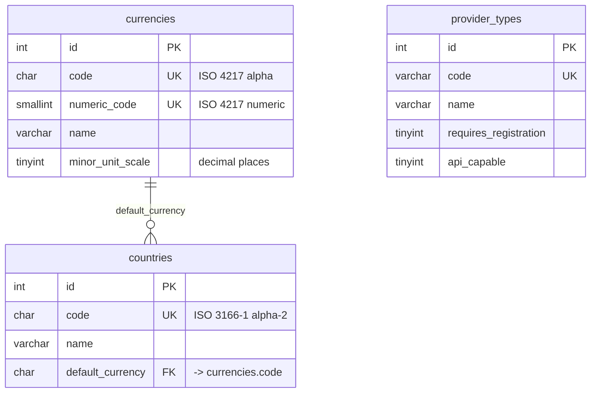
```mermaid
erDiagram
    currencies {
        int id PK
        char code UK "ISO 4217 alpha"
        smallint numeric_code UK "ISO 4217 numeric"
        varchar name
        tinyint minor_unit_scale "decimal places"
    }
    countries {
        int id PK
        char code UK "ISO 3166-1 alpha-2"
        varchar name
        char default_currency FK "-> currencies.code"
    }
    provider_types {
        int id PK
        varchar code UK
        varchar name
        tinyint requires_registration
        tinyint api_capable
    }

    currencies ||--o{ countries : "default_currency"
```

`provider_types` has no relationships yet — the capability tables that will reference it are
Phase 8.

## Cross-cutting (Phase 5)

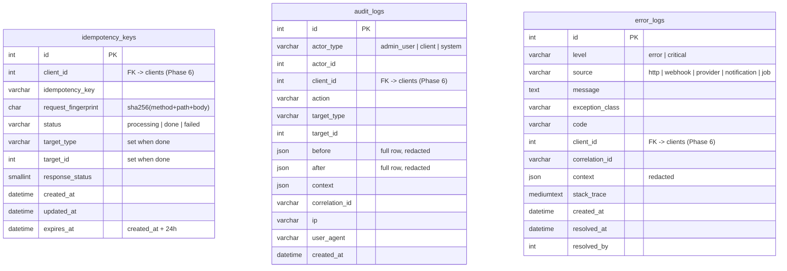
```mermaid
erDiagram
    idempotency_keys {
        int id PK
        int client_id "FK -> clients (Phase 6)"
        varchar idempotency_key
        char request_fingerprint "sha256(method+path+body)"
        varchar status "processing | done | failed"
        varchar target_type "set when done"
        int target_id "set when done"
        smallint response_status
        datetime created_at
        datetime updated_at
        datetime expires_at "created_at + 24h"
    }
    audit_logs {
        int id PK
        varchar actor_type "admin_user | client | system"
        int actor_id
        int client_id "FK -> clients (Phase 6)"
        varchar action
        varchar target_type
        int target_id
        json before "full row, redacted"
        json after "full row, redacted"
        json context
        varchar correlation_id
        varchar ip
        varchar user_agent
        datetime created_at
    }
    error_logs {
        int id PK
        varchar level "error | critical"
        varchar source "http | webhook | provider | notification | job"
        text message
        varchar exception_class
        varchar code
        int client_id "FK -> clients (Phase 6)"
        varchar correlation_id
        json context "redacted"
        mediumtext stack_trace
        datetime created_at
        datetime resolved_at
        int resolved_by
    }
```

The `client_id` foreign keys were added in Phase 6 (`AddClientFksToCrossCuttingTables`):
`idempotency_keys` → CASCADE, `audit_logs` / `error_logs` → SET NULL.
`uniq_idempotency_keys_client_key (client_id, idempotency_key)` enforces one key per client.

## Clients (Phase 6)

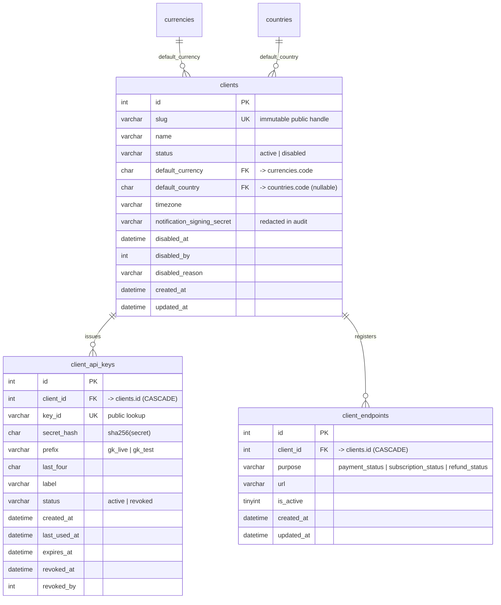
```mermaid
erDiagram
    clients {
        int id PK
        varchar slug UK "immutable public handle"
        varchar name
        varchar status "active | disabled"
        char default_currency FK "-> currencies.code"
        char default_country FK "-> countries.code (nullable)"
        varchar timezone
        varchar notification_signing_secret "redacted in audit"
        datetime disabled_at
        int disabled_by
        varchar disabled_reason
        datetime created_at
        datetime updated_at
    }
    client_api_keys {
        int id PK
        int client_id FK "-> clients.id (CASCADE)"
        varchar key_id UK "public lookup"
        char secret_hash "sha256(secret)"
        varchar prefix "gk_live | gk_test"
        char last_four
        varchar label
        varchar status "active | revoked"
        datetime created_at
        datetime last_used_at
        datetime expires_at
        datetime revoked_at
        int revoked_by
    }
    client_endpoints {
        int id PK
        int client_id FK "-> clients.id (CASCADE)"
        varchar purpose "payment_status | subscription_status | refund_status"
        varchar url
        tinyint is_active
        datetime created_at
        datetime updated_at
    }

    clients ||--o{ client_api_keys : "issues"
    clients ||--o{ client_endpoints : "registers"
    currencies ||--o{ clients : "default_currency"
    countries ||--o{ clients : "default_country"
```

`UNIQUE (client_id, purpose)` on `client_endpoints` — one active URL per purpose.

## Client API authentication (Phase 7)

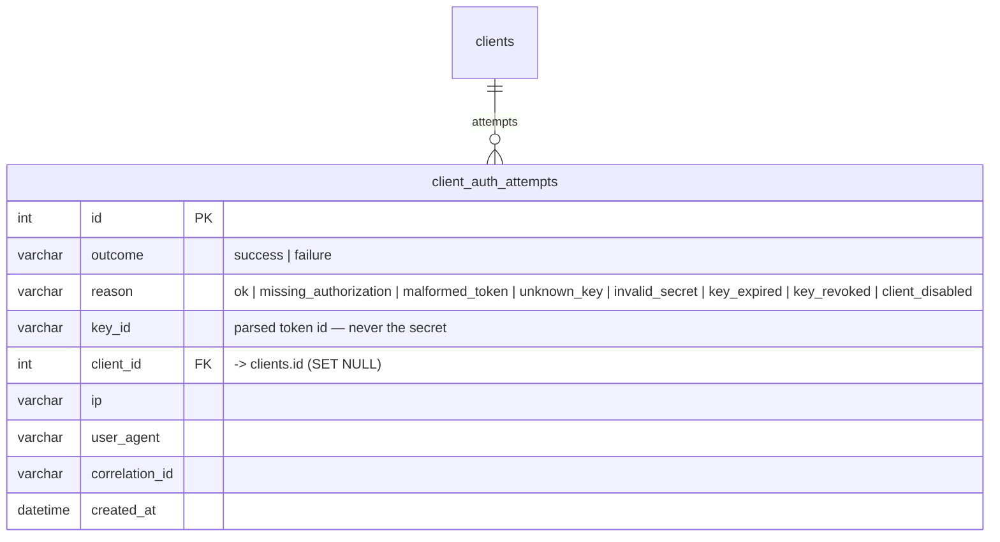
```mermaid
erDiagram
    client_auth_attempts {
        int id PK
        varchar outcome "success | failure"
        varchar reason "ok | missing_authorization | malformed_token | unknown_key | invalid_secret | key_expired | key_revoked | client_disabled"
        varchar key_id "parsed token id — never the secret"
        int client_id FK "-> clients.id (SET NULL)"
        varchar ip
        varchar user_agent
        varchar correlation_id
        datetime created_at
    }

    clients ||--o{ client_auth_attempts : "attempts"
```

Append-only. Written best-effort by `ApiKeyAuthenticator` on every `/api/v1` auth attempt. No
schema change to `client_api_keys` — `last_used_at` is now stamped (throttled ≤ 1/key/5 min).

## Providers (Phase 8)

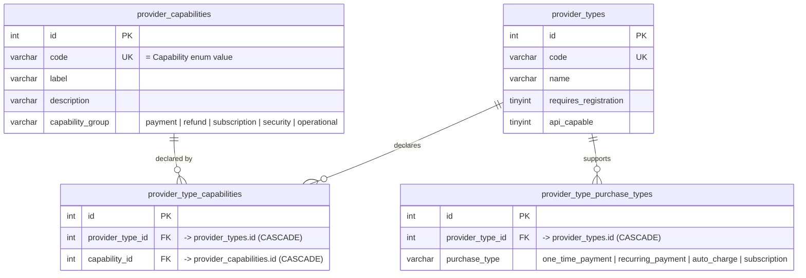
```mermaid
erDiagram
    provider_types {
        int id PK
        varchar code UK
        varchar name
        tinyint requires_registration
        tinyint api_capable
    }
    provider_capabilities {
        int id PK
        varchar code UK "= Capability enum value"
        varchar label
        varchar description
        varchar capability_group "payment | refund | subscription | security | operational"
    }
    provider_type_capabilities {
        int id PK
        int provider_type_id FK "-> provider_types.id (CASCADE)"
        int capability_id FK "-> provider_capabilities.id (CASCADE)"
    }
    provider_type_purchase_types {
        int id PK
        int provider_type_id FK "-> provider_types.id (CASCADE)"
        varchar purchase_type "one_time_payment | recurring_payment | auto_charge | subscription"
    }

    provider_types ||--o{ provider_type_capabilities : "declares"
    provider_capabilities ||--o{ provider_type_capabilities : "declared by"
    provider_types ||--o{ provider_type_purchase_types : "supports"
```

Seeded for **stripe + paypal** only (Phase 8 Q5); ziraat / mollie capability rows land in their
adapter phases. `provider_capabilities` is a seeded mirror of the `Capability` enum. Payment
methods are **not** modelled at the type level (Q4).

## Providers — accounts (Phase 9)

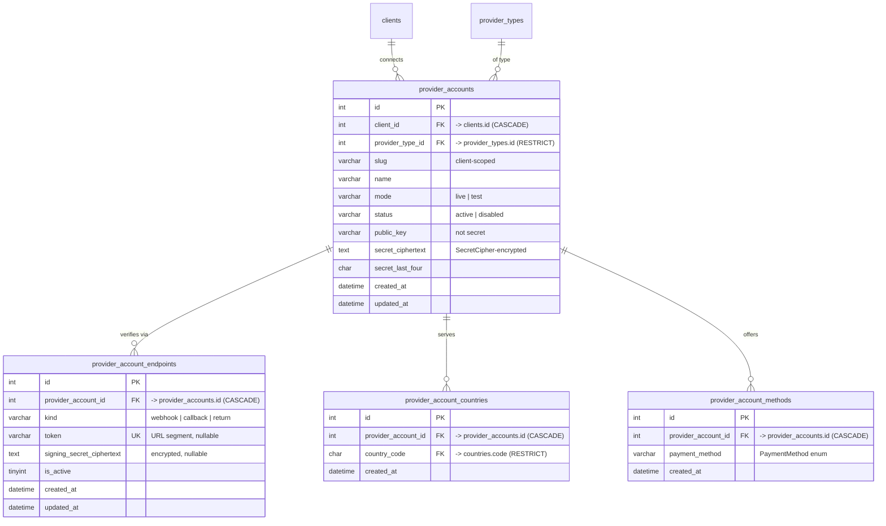
```mermaid
erDiagram
    provider_accounts {
        int id PK
        int client_id FK "-> clients.id (CASCADE)"
        int provider_type_id FK "-> provider_types.id (RESTRICT)"
        varchar slug "client-scoped"
        varchar name
        varchar mode "live | test"
        varchar status "active | disabled"
        varchar public_key "not secret"
        text secret_ciphertext "SecretCipher-encrypted"
        char secret_last_four
        datetime created_at
        datetime updated_at
    }
    provider_account_endpoints {
        int id PK
        int provider_account_id FK "-> provider_accounts.id (CASCADE)"
        varchar kind "webhook | callback | return"
        varchar token UK "URL segment, nullable"
        text signing_secret_ciphertext "encrypted, nullable"
        tinyint is_active
        datetime created_at
        datetime updated_at
    }
    provider_account_countries {
        int id PK
        int provider_account_id FK "-> provider_accounts.id (CASCADE)"
        char country_code FK "-> countries.code (RESTRICT)"
        datetime created_at
    }
    provider_account_methods {
        int id PK
        int provider_account_id FK "-> provider_accounts.id (CASCADE)"
        varchar payment_method "PaymentMethod enum"
        datetime created_at
    }

    clients ||--o{ provider_accounts : "connects"
    provider_types ||--o{ provider_accounts : "of type"
    provider_accounts ||--o{ provider_account_endpoints : "verifies via"
    provider_accounts ||--o{ provider_account_countries : "serves"
    provider_accounts ||--o{ provider_account_methods : "offers"
```

Secret keys are encrypted with `Shared\Application\SecretCipher` (`SodiumSecretCipher`, key from
`APP_ENCRYPTION_KEY`). Account-level capability narrowing is **not** modelled — inherited from
the provider type (Phase 9 Q4). `local-dev` gets a seeded `stripe/test` account
(`APP_ENV ∈ {local, testing}` only).

## Providers — routing (Phase 10)

```mermaid
erDiagram
    provider_groups {
        int id PK
        int client_id FK "-> clients.id (CASCADE)"
        varchar slug "client-scoped"
        varchar name
        tinyint is_default "fallback group, no countries"
        varchar device_type "web | ios | android | NULL"
        char currency_code FK "-> currencies.code (RESTRICT), nullable"
        varchar status "active | disabled"
        datetime created_at
        datetime updated_at
    }
    provider_group_countries {
        int id PK
        int provider_group_id FK "-> provider_groups.id (CASCADE)"
        char country_code FK "-> countries.code (RESTRICT)"
        datetime created_at
    }
    provider_group_accounts {
        int id PK
        int provider_group_id FK "-> provider_groups.id (CASCADE)"
        int provider_account_id FK "-> provider_accounts.id (CASCADE)"
        smallint priority "asc = tried first"
        tinyint is_enabled
        datetime created_at
    }
    provider_group_purchase_types {
        int id PK
        int provider_group_id FK "-> provider_groups.id (CASCADE)"
        varchar purchase_type "PurchaseType enum"
        datetime created_at
    }
    provider_group_methods {
        int id PK
        int provider_group_id FK "-> provider_groups.id (CASCADE)"
        varchar payment_method "PaymentMethod enum"
        datetime created_at
    }

    clients ||--o{ provider_groups : "routes via"
    currencies ||--o{ provider_groups : "settles in"
    provider_groups ||--o{ provider_group_countries : "covers"
    countries ||--o{ provider_group_countries : "grouped by"
    provider_groups ||--o{ provider_group_accounts : "prioritises"
    provider_accounts ||--o{ provider_group_accounts : "listed in"
    provider_groups ||--o{ provider_group_purchase_types : "sells"
    provider_groups ||--o{ provider_group_methods : "allows"
```

Provider groups are the **only** country→provider mechanism (Phase 10 Q1 — no
`country_provider_configs` tables). `ProviderRouter` resolves the group for a request, then
filters the ordered accounts by mode / status / served country / purchase type (group set ∩
provider-type declaration) / method, and returns an in-memory `RoutingDecision` (ordered
candidates + rejections). Unsupported combinations are **rejected, never downgraded**. No
routing snapshot table this phase (Q4). `local-dev` gets seeded `turkey` / `germany` /
`netherlands` / `default` groups (`APP_ENV ∈ {local, testing}` only).

## Packages — catalog & availability (Phase 11)

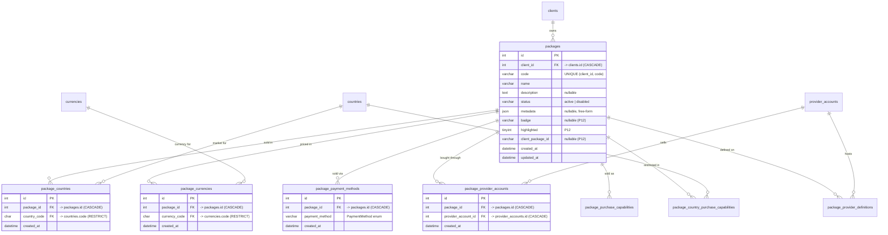
```mermaid
erDiagram
    packages {
        int id PK
        int client_id FK "-> clients.id (CASCADE)"
        varchar code "UNIQUE (client_id, code)"
        varchar name
        text description "nullable"
        varchar status "active | disabled"
        json metadata "nullable, free-form"
        varchar badge "nullable (P12)"
        tinyint highlighted "P12"
        varchar client_package_id "nullable (P12)"
        datetime created_at
        datetime updated_at
    }
    package_countries {
        int id PK
        int package_id FK "-> packages.id (CASCADE)"
        char country_code FK "-> countries.code (RESTRICT)"
        datetime created_at
    }
    package_currencies {
        int id PK
        int package_id FK "-> packages.id (CASCADE)"
        char currency_code FK "-> currencies.code (RESTRICT)"
        datetime created_at
    }
    package_payment_methods {
        int id PK
        int package_id FK "-> packages.id (CASCADE)"
        varchar payment_method "PaymentMethod enum"
        datetime created_at
    }
    package_provider_accounts {
        int id PK
        int package_id FK "-> packages.id (CASCADE)"
        int provider_account_id FK "-> provider_accounts.id (CASCADE)"
        datetime created_at
    }

    clients ||--o{ packages : "owns"
    packages ||--o{ package_countries : "sold in"
    countries ||--o{ package_countries : "market for"
    packages ||--o{ package_currencies : "priced in"
    currencies ||--o{ package_currencies : "currency for"
    packages ||--o{ package_payment_methods : "sold via"
    packages ||--o{ package_provider_accounts : "bought through"
    provider_accounts ||--o{ package_provider_accounts : "sells"
    packages ||--o{ package_purchase_capabilities : "sold as"
    packages ||--o{ package_country_purchase_capabilities : "restricted in"
    countries ||--o{ package_country_purchase_capabilities : "restricts"
    packages ||--o{ package_provider_definitions : "defined on"
    provider_accounts ||--o{ package_provider_definitions : "hosts"
```

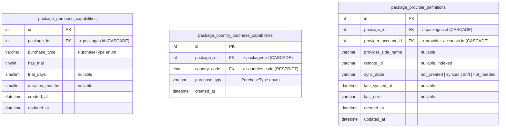
```mermaid
erDiagram
    package_purchase_capabilities {
        int id PK
        int package_id FK "-> packages.id (CASCADE)"
        varchar purchase_type "PurchaseType enum"
        tinyint has_trial
        smallint trial_days "nullable"
        smallint duration_months "nullable"
        datetime created_at
        datetime updated_at
    }
    package_country_purchase_capabilities {
        int id PK
        int package_id FK "-> packages.id (CASCADE)"
        char country_code FK "-> countries.code (RESTRICT)"
        varchar purchase_type "PurchaseType enum"
        datetime created_at
    }
    package_provider_definitions {
        int id PK
        int package_id FK "-> packages.id (CASCADE)"
        int provider_account_id FK "-> provider_accounts.id (CASCADE)"
        varchar provider_side_name "nullable"
        varchar remote_id "nullable, indexed"
        varchar sync_state "not_created | synced | drift | not_needed"
        datetime last_synced_at "nullable"
        varchar last_error "nullable"
        datetime created_at
        datetime updated_at
    }
```

Client-owned catalogue (one `packages` table with `client_id`, `code` unique per client — no
global catalogue, no `client_packages` junction). Each of the four availability dimensions is
**fail open**: an empty set = available everywhere for that dimension (Phase 11 Q2); rows
restrict. A package's **purchase types** (Phase 12) are stored in `package_purchase_capabilities`
(fail **closed** — no rows = not sellable) with per-type trial / duration; a
`package_country_purchase_capabilities` override **replaces** the global set for one country.
`PackageCatalog::resolve(client, country, currency, ?method)` returns the active, market-matching
**sellable** packages with provider accounts narrowed to the client's active set and the
country-effective purchase capabilities. `package_provider_definitions` tracks where a package
exists on each provider account (`sync_state` 4-state machine; editing a package flips `synced` →
`drift`). **No price yet — Phase 13.** `local-dev` seeds `starter` (one-time) + `pro`
(one-time + subscription, 7-day trial) (`APP_ENV ∈ {local, testing}` only).

## Pricing — groups & default prices (Phase 13)

```mermaid
erDiagram
    pricing_groups {
        int id PK
        int client_id FK "-> clients.id (CASCADE)"
        varchar slug "UNIQUE (client_id, slug)"
        varchar name
        smallint priority "ascending = checked first; default last"
        varchar device_type "web | ios | android | NULL"
        char currency_code FK "-> currencies.code (RESTRICT)"
        tinyint is_default "fallback, no countries"
        varchar status "active | disabled"
        datetime created_at
        datetime updated_at
    }
    pricing_group_countries {
        int id PK
        int pricing_group_id FK "-> pricing_groups.id (CASCADE)"
        char country_code FK "-> countries.code (RESTRICT); overlap allowed"
        datetime created_at
    }
    default_package_prices {
        int id PK
        int package_id FK "-> packages.id (CASCADE), UNIQUE"
        bigint amount_minor
        char currency_code FK "-> currencies.code (RESTRICT)"
        datetime created_at
        datetime updated_at
    }
    client_exchange_rates {
        int id PK
        int client_id FK "-> clients.id (CASCADE)"
        char base_currency FK "-> currencies.code (RESTRICT)"
        char quote_currency FK "-> currencies.code (RESTRICT)"
        decimal rate "1 base = rate quote"
        datetime effective_from
        datetime created_at
    }
    pricing_group_packages {
        int id PK
        int pricing_group_id FK "-> pricing_groups.id (CASCADE)"
        int package_id FK "-> packages.id (CASCADE)"
        varchar status "default | override | disabled"
        bigint amount_minor "override only, nullable"
        char currency_code FK "-> currencies.code, override only, = group currency"
        varchar name_override "nullable"
        varchar badge_override "nullable"
        tinyint highlighted_override "nullable"
        smallint display_order
        datetime created_at
        datetime updated_at
    }

    clients ||--o{ pricing_groups : "prices via"
    currencies ||--o{ pricing_groups : "settles in"
    pricing_groups ||--o{ pricing_group_countries : "covers"
    countries ||--o{ pricing_group_countries : "grouped by"
    packages ||--o| default_package_prices : "baseline"
    clients ||--o{ client_exchange_rates : "converts with"
    pricing_groups ||--o{ pricing_group_packages : "prices"
    packages ||--o{ pricing_group_packages : "priced in"
```

Priority-ordered country grouping (overlap allowed — lowest `priority` wins; `is_default` last).
`default_package_prices` is the one baseline per package; a `status=default` group-package in a
different currency converts via `client_exchange_rates` (the latest effective row).
`status=override` carries its own amount in the group currency; `status=disabled` hides the
package in that group; no row = implicit `default`. `PriceResolver` / `PriceCatalog` produce a
`ResolvedPrice` (`baseline` / `converted` / `group_override`); `GET /api/v1/packages` and
`GET /api/v1/pricing/resolve` mount this phase. `local-dev` seeds `default` (EUR) / `dach`
(DE/AT/CH, EUR, `pro` overridden €24) / `us` (USD, converted) groups + an EUR→USD rate.

## Pricing — dimension overrides (Phase 14)

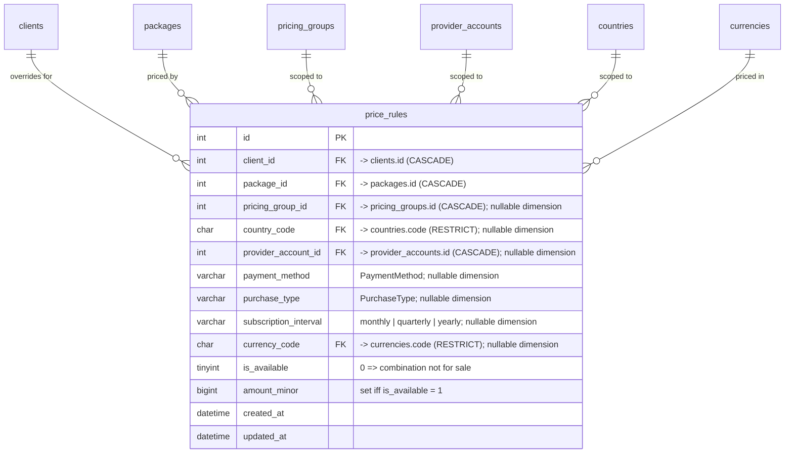
```mermaid
erDiagram
    price_rules {
        int id PK
        int client_id FK "-> clients.id (CASCADE)"
        int package_id FK "-> packages.id (CASCADE)"
        int pricing_group_id FK "-> pricing_groups.id (CASCADE); nullable dimension"
        char country_code FK "-> countries.code (RESTRICT); nullable dimension"
        int provider_account_id FK "-> provider_accounts.id (CASCADE); nullable dimension"
        varchar payment_method "PaymentMethod; nullable dimension"
        varchar purchase_type "PurchaseType; nullable dimension"
        varchar subscription_interval "monthly | quarterly | yearly; nullable dimension"
        char currency_code FK "-> currencies.code (RESTRICT); nullable dimension"
        tinyint is_available "0 => combination not for sale"
        bigint amount_minor "set iff is_available = 1"
        datetime created_at
        datetime updated_at
    }

    clients ||--o{ price_rules : "overrides for"
    packages ||--o{ price_rules : "priced by"
    pricing_groups ||--o{ price_rules : "scoped to"
    provider_accounts ||--o{ price_rules : "scoped to"
    countries ||--o{ price_rules : "scoped to"
    currencies ||--o{ price_rules : "priced in"
```

One `(client, package)` override table keyed by up to 7 nullable dimensions (null = wildcard).
`UNIQUE (package_id, pricing_group_id, country_code, provider_account_id, payment_method,
purchase_type, subscription_interval, currency_code)`. Layered *after* the Phase 13 base price:
`PriceRuleResolver` picks the most-specific matching rule (most matched dimensions → fixed
dimension priority → highest `id`). An available winner replaces the amount
(`ResolvedPrice.source = dimension_override`); an `is_available = 0` winner fails the resolve
with `pricing.combination_unavailable` (no fallback). `GET /api/v1/pricing/resolve` gains
`method` / `purchase_type` / `interval` query params. `local-dev` seeds a `pro` Stripe+EUR rule
(€27) and a `pro` US-group yearly-subscription unavailable rule.

## Pricing — A/B price lists (Phase 15; visitor assignment — Phase 24 Q6/Q7)

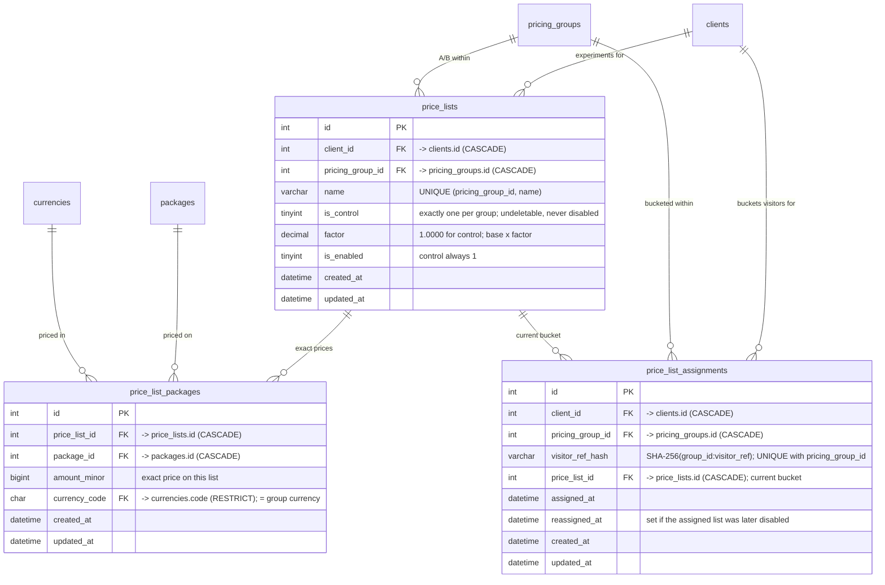
```mermaid
erDiagram
    price_lists {
        int id PK
        int client_id FK "-> clients.id (CASCADE)"
        int pricing_group_id FK "-> pricing_groups.id (CASCADE)"
        varchar name "UNIQUE (pricing_group_id, name)"
        tinyint is_control "exactly one per group; undeletable, never disabled"
        decimal factor "1.0000 for control; base x factor"
        tinyint is_enabled "control always 1"
        datetime created_at
        datetime updated_at
    }
    price_list_packages {
        int id PK
        int price_list_id FK "-> price_lists.id (CASCADE)"
        int package_id FK "-> packages.id (CASCADE)"
        bigint amount_minor "exact price on this list"
        char currency_code FK "-> currencies.code (RESTRICT); = group currency"
        datetime created_at
        datetime updated_at
    }
    price_list_assignments {
        int id PK
        int client_id FK "-> clients.id (CASCADE)"
        int pricing_group_id FK "-> pricing_groups.id (CASCADE)"
        varchar visitor_ref_hash "SHA-256(group_id:visitor_ref); UNIQUE with pricing_group_id"
        int price_list_id FK "-> price_lists.id (CASCADE); current bucket"
        datetime assigned_at
        datetime reassigned_at "set if the assigned list was later disabled"
        datetime created_at
        datetime updated_at
    }

    clients ||--o{ price_lists : "experiments for"
    pricing_groups ||--o{ price_lists : "A/B within"
    price_lists ||--o{ price_list_packages : "exact prices"
    packages ||--o{ price_list_packages : "priced on"
    currencies ||--o{ price_list_packages : "priced in"
    clients ||--o{ price_list_assignments : "buckets visitors for"
    pricing_groups ||--o{ price_list_assignments : "bucketed within"
    price_lists ||--o{ price_list_assignments : "current bucket"
```

Every pricing group owns one control list (`is_control = 1`, `factor = 1.0000`, always enabled,
created with the group + backfilled by the migration). A non-control list shifts the resolved
base price by `factor`, or by an exact `price_list_packages` amount per package.
`PriceListResolver` runs between the Phase 13 base amount and the Phase 14 `price_rules` step:
an exact list-package amount → else `base × factor` → else the base unchanged
(`ResolvedPrice.source = price_list` when the amount moved). `local-dev` seeds a control list per
group + a disabled `dach` "List B · -10%" with an exact `pro` €21.00.

**Visitor→list assignment (Phase 15 Q4/Q5, decided fresh at Phase 24 Q6/Q7):** persisted in
`price_list_assignments`, one row per `(pricing_group_id, visitor_ref_hash)`. On first sight,
`ResolveVisitorPriceListAssignment` buckets by a deterministic hash over the group's
currently-enabled lists and persists the row (a `LAST_INSERT_ID(id)`-on-conflict upsert makes a
concurrent first-visit race resolve to one authoritative row rather than throwing). Later visits
read the stored bucket; if it's since been disabled, the row reassigns to control on that read.
Wired into `GET /api/v1/packages`, `GET /api/v1/packages/{packageId}`, and
`GET /api/v1/pricing/resolve` via an optional `visitor_ref` query param (Q7: both endpoints
persist).

## Vouchers — definitions & eligibility (Phase 16)

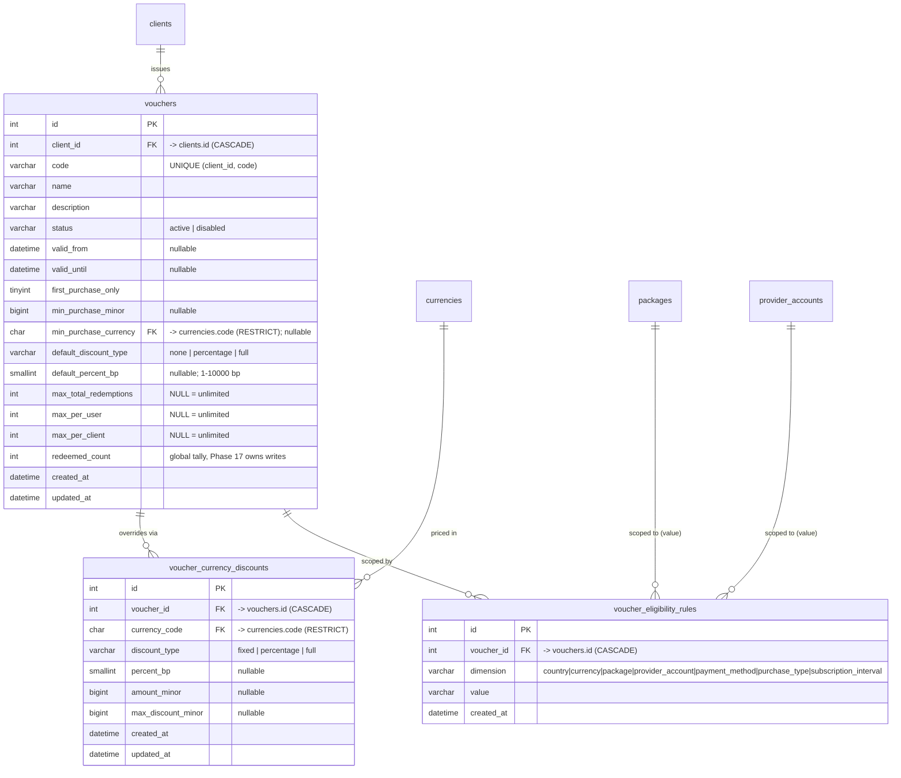
```mermaid
erDiagram
    vouchers {
        int id PK
        int client_id FK "-> clients.id (CASCADE)"
        varchar code "UNIQUE (client_id, code)"
        varchar name
        varchar description
        varchar status "active | disabled"
        datetime valid_from "nullable"
        datetime valid_until "nullable"
        tinyint first_purchase_only
        bigint min_purchase_minor "nullable"
        char min_purchase_currency FK "-> currencies.code (RESTRICT); nullable"
        varchar default_discount_type "none | percentage | full"
        smallint default_percent_bp "nullable; 1-10000 bp"
        int max_total_redemptions "NULL = unlimited"
        int max_per_user "NULL = unlimited"
        int max_per_client "NULL = unlimited"
        int redeemed_count "global tally, Phase 17 owns writes"
        datetime created_at
        datetime updated_at
    }
    voucher_eligibility_rules {
        int id PK
        int voucher_id FK "-> vouchers.id (CASCADE)"
        varchar dimension "country|currency|package|provider_account|payment_method|purchase_type|subscription_interval"
        varchar value
        datetime created_at
    }
    voucher_currency_discounts {
        int id PK
        int voucher_id FK "-> vouchers.id (CASCADE)"
        char currency_code FK "-> currencies.code (RESTRICT)"
        varchar discount_type "fixed | percentage | full"
        smallint percent_bp "nullable"
        bigint amount_minor "nullable"
        bigint max_discount_minor "nullable"
        datetime created_at
        datetime updated_at
    }

    clients ||--o{ vouchers : "issues"
    vouchers ||--o{ voucher_eligibility_rules : "scoped by"
    vouchers ||--o{ voucher_currency_discounts : "overrides via"
    currencies ||--o{ voucher_currency_discounts : "priced in"
    packages ||--o{ voucher_eligibility_rules : "scoped to (value)"
    provider_accounts ||--o{ voucher_eligibility_rules : "scoped to (value)"
```

Client-scoped discount codes. `voucher_eligibility_rules` — OR within a dimension, AND across, no
rows = unrestricted (`package` / `provider_account` values validated at write time, not a DB FK).
`voucher_currency_discounts` overrides the voucher's default discount per currency; a currency
using the default has no row. Usage limits are plain nullable columns on `vouchers`
(`max_total_redemptions` / `max_per_user` / `max_per_client`, `NULL` = unlimited) — no per-scope
table. `VoucherEligibilityEvaluator` reports every unmet condition, including the global / per-user
/ per-client usage caps implemented in Phase 17 (below). `local-dev` seeds `WELCOME10` (10%,
once per user) and `EU5` (`none` default, EUR/USD/GBP fixed overrides, restricted to the `pro`
package). Full rule set: **`.claude/Voucher.md`**.

## Vouchers — redemption lifecycle (Phase 17)

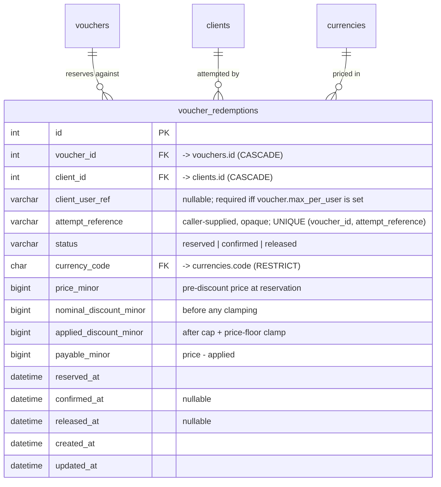
```mermaid
erDiagram
    voucher_redemptions {
        int id PK
        int voucher_id FK "-> vouchers.id (CASCADE)"
        int client_id FK "-> clients.id (CASCADE)"
        varchar client_user_ref "nullable; required iff voucher.max_per_user is set"
        varchar attempt_reference "caller-supplied, opaque; UNIQUE (voucher_id, attempt_reference)"
        varchar status "reserved | confirmed | released"
        char currency_code FK "-> currencies.code (RESTRICT)"
        bigint price_minor "pre-discount price at reservation"
        bigint nominal_discount_minor "before any clamping"
        bigint applied_discount_minor "after cap + price-floor clamp"
        bigint payable_minor "price - applied"
        datetime reserved_at
        datetime confirmed_at "nullable"
        datetime released_at "nullable"
        datetime created_at
        datetime updated_at
    }

    vouchers ||--o{ voucher_redemptions : "reserves against"
    clients ||--o{ voucher_redemptions : "attempted by"
    currencies ||--o{ voucher_redemptions : "priced in"
```

`reserved -> confirmed` (terminal) or `reserved -> released` (terminal), keyed by `(voucher_id,
attempt_reference)` — Phase 20 will pass the payment id as `attempt_reference`. A `reserved` row
counts toward every usage cap immediately and keeps counting until released; there is no
automatic expiry (a stale-reservation sweep is a Phase 29 background job). Every
reserve/confirm/release handler locks the `vouchers` row (`SELECT ... FOR UPDATE`) before
touching this table, making it the per-voucher mutex that closes the race on the caps.
`VoucherDiscountCalculator` computes `nominal_discount_minor` / `applied_discount_minor` /
`payable_minor` at reserve time; confirm increments `vouchers.redeemed_count` exactly once.
Full rule set: **`.claude/Voucher.md`**.

## Checkout + decision snapshots (Phase 18)

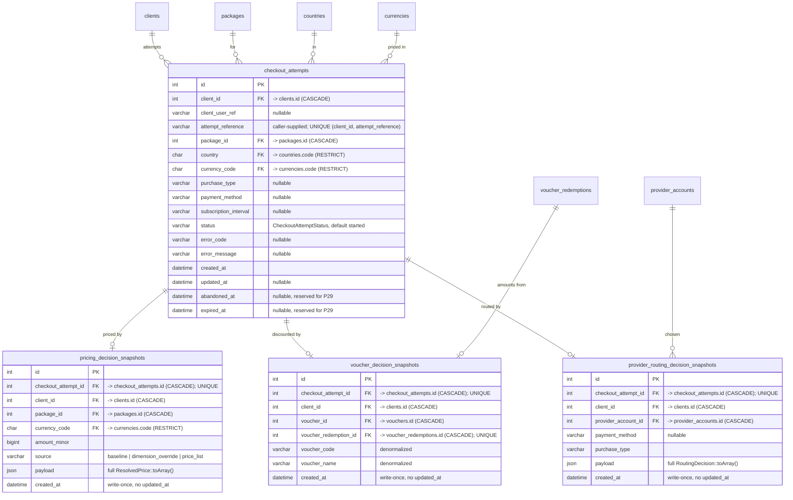
```mermaid
erDiagram
    checkout_attempts {
        int id PK
        int client_id FK "-> clients.id (CASCADE)"
        varchar client_user_ref "nullable"
        varchar attempt_reference "caller-supplied; UNIQUE (client_id, attempt_reference)"
        int package_id FK "-> packages.id (CASCADE)"
        char country FK "-> countries.code (RESTRICT)"
        char currency_code FK "-> currencies.code (RESTRICT)"
        varchar purchase_type "nullable"
        varchar payment_method "nullable"
        varchar subscription_interval "nullable"
        varchar status "CheckoutAttemptStatus, default started"
        varchar error_code "nullable"
        varchar error_message "nullable"
        datetime created_at
        datetime updated_at "nullable"
        datetime abandoned_at "nullable, reserved for P29"
        datetime expired_at "nullable, reserved for P29"
    }
    pricing_decision_snapshots {
        int id PK
        int checkout_attempt_id FK "-> checkout_attempts.id (CASCADE); UNIQUE"
        int client_id FK "-> clients.id (CASCADE)"
        int package_id FK "-> packages.id (CASCADE)"
        char currency_code FK "-> currencies.code (RESTRICT)"
        bigint amount_minor
        varchar source "baseline | dimension_override | price_list"
        json payload "full ResolvedPrice::toArray()"
        datetime created_at "write-once, no updated_at"
    }
    voucher_decision_snapshots {
        int id PK
        int checkout_attempt_id FK "-> checkout_attempts.id (CASCADE); UNIQUE"
        int client_id FK "-> clients.id (CASCADE)"
        int voucher_id FK "-> vouchers.id (CASCADE)"
        int voucher_redemption_id FK "-> voucher_redemptions.id (CASCADE); UNIQUE"
        varchar voucher_code "denormalized"
        varchar voucher_name "denormalized"
        datetime created_at "write-once, no updated_at"
    }
    provider_routing_decision_snapshots {
        int id PK
        int checkout_attempt_id FK "-> checkout_attempts.id (CASCADE); UNIQUE"
        int client_id FK "-> clients.id (CASCADE)"
        int provider_account_id FK "-> provider_accounts.id (CASCADE)"
        varchar payment_method "nullable"
        varchar purchase_type
        json payload "full RoutingDecision::toArray()"
        datetime created_at "write-once, no updated_at"
    }

    clients ||--o{ checkout_attempts : "attempts"
    packages ||--o{ checkout_attempts : "for"
    countries ||--o{ checkout_attempts : "in"
    currencies ||--o{ checkout_attempts : "priced in"
    checkout_attempts ||--o| pricing_decision_snapshots : "priced by"
    checkout_attempts ||--o| voucher_decision_snapshots : "discounted by"
    checkout_attempts ||--o| provider_routing_decision_snapshots : "routed by"
    voucher_redemptions ||--o| voucher_decision_snapshots : "amounts from"
    provider_accounts ||--o{ provider_routing_decision_snapshots : "chosen"
```

`checkout_attempts` is the new `Checkout` module's anchor table — `attempt_reference` is the
external idempotent key, `id` is the internal FK target for the three decision-snapshot tables
(one per owning module: Pricing / Vouchers / Providers), each `UNIQUE (checkout_attempt_id)` and
write-once (no update method on any repository port). Lifecycle is a 9-rank happy path
(`started` → … → `converted_to_payment`) plus 4 unranked exit statuses
(`failed`/`canceled`/`expired`/`abandoned`) reachable from any non-terminal status; skipping ranks
is allowed (no voucher ⇒ `pricing_resolved → provider_selected` directly). Phase 18 drives
`started → pricing_resolved → (voucher_reserved →) provider_selected` and any non-terminal → exit
for real; `provider_checkout_created` … `confirmed`/`converted_to_payment` are modelled for
Payments (Phase 20) and the provider adapters (Phase 21+). When a `payments` row is created later
it links back and copies only `CheckoutAttempt::commercialSnapshot()`'s immutable fields — no
checkout-attempt or decision-snapshot row is ever deleted. Full detail:
`.claude/docs/database-design.md` → "Checkout + decision snapshots (Phase 18)".

## Payments — aggregate & lifecycle (Phase 20)

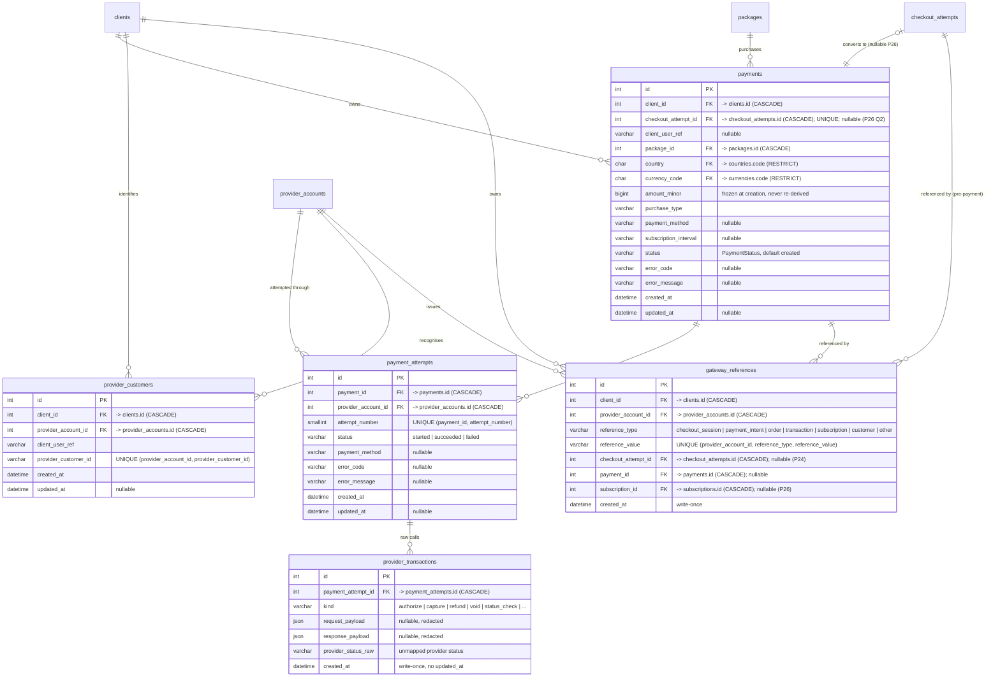
```mermaid
erDiagram
    payments {
        int id PK
        int client_id FK "-> clients.id (CASCADE)"
        int checkout_attempt_id FK "-> checkout_attempts.id (CASCADE); UNIQUE; nullable (P26 Q2)"
        varchar client_user_ref "nullable"
        int package_id FK "-> packages.id (CASCADE)"
        char country FK "-> countries.code (RESTRICT)"
        char currency_code FK "-> currencies.code (RESTRICT)"
        bigint amount_minor "frozen at creation, never re-derived"
        varchar purchase_type
        varchar payment_method "nullable"
        varchar subscription_interval "nullable"
        varchar status "PaymentStatus, default created"
        varchar error_code "nullable"
        varchar error_message "nullable"
        datetime created_at
        datetime updated_at "nullable"
    }
    payment_attempts {
        int id PK
        int payment_id FK "-> payments.id (CASCADE)"
        int provider_account_id FK "-> provider_accounts.id (CASCADE)"
        smallint attempt_number "UNIQUE (payment_id, attempt_number)"
        varchar status "started | succeeded | failed"
        varchar payment_method "nullable"
        varchar error_code "nullable"
        varchar error_message "nullable"
        datetime created_at
        datetime updated_at "nullable"
    }
    provider_transactions {
        int id PK
        int payment_attempt_id FK "-> payment_attempts.id (CASCADE)"
        varchar kind "authorize | capture | refund | void | status_check | ..."
        json request_payload "nullable, redacted"
        json response_payload "nullable, redacted"
        varchar provider_status_raw "unmapped provider status"
        datetime created_at "write-once, no updated_at"
    }
    provider_customers {
        int id PK
        int client_id FK "-> clients.id (CASCADE)"
        int provider_account_id FK "-> provider_accounts.id (CASCADE)"
        varchar client_user_ref
        varchar provider_customer_id "UNIQUE (provider_account_id, provider_customer_id)"
        datetime created_at
        datetime updated_at "nullable"
    }
    gateway_references {
        int id PK
        int client_id FK "-> clients.id (CASCADE)"
        int provider_account_id FK "-> provider_accounts.id (CASCADE)"
        varchar reference_type "checkout_session | payment_intent | order | transaction | subscription | customer | other"
        varchar reference_value "UNIQUE (provider_account_id, reference_type, reference_value)"
        int checkout_attempt_id FK "-> checkout_attempts.id (CASCADE); nullable (P24)"
        int payment_id FK "-> payments.id (CASCADE); nullable"
        int subscription_id FK "-> subscriptions.id (CASCADE); nullable (P26)"
        datetime created_at "write-once"
    }

    clients ||--o{ payments : "owns"
    checkout_attempts |o--|| payments : "converts to (nullable P26)"
    packages ||--o{ payments : "purchases"
    payments ||--o{ payment_attempts : "tries via"
    provider_accounts ||--o{ payment_attempts : "attempted through"
    payment_attempts ||--o{ provider_transactions : "raw calls"
    clients ||--o{ provider_customers : "identifies"
    provider_accounts ||--o{ provider_customers : "recognises"
    clients ||--o{ gateway_references : "owns"
    provider_accounts ||--o{ gateway_references : "issues"
    checkout_attempts ||--o{ gateway_references : "referenced by (pre-payment)"
    payments ||--o{ gateway_references : "referenced by"
```

A payment was originally created from exactly one confirmed `checkout_attempts` row only (Q1,
`UNIQUE (checkout_attempt_id)`) — `amount_minor` is frozen from the pricing/voucher decision
snapshots at that moment, never re-derived. **Phase 26 Q2 added a second creation path**:
`checkout_attempt_id` is now nullable, since a subscription renewal charge is a real `payments`
row with no checkout attempt of its own (linked to its subscription via
`subscription_payment_links` instead — see the Subscriptions section below). `payment_attempts` →
`provider_transactions` is a deliberate two-level hierarchy (Q3): an attempt is one distinct "try"
against a provider (a declined card retried with a different method is a *new* attempt,
`attempt_number` incrementing), while each raw call/response under that attempt gets its own
immutable `provider_transactions` row. `provider_customers` and `gateway_references` (Q4) are
separate concerns — a durable customer identity reused across payments vs. a generic,
provider-agnostic reverse-lookup table. `gateway_references` carries three nullable parent
columns now: `checkout_attempt_id` (Phase 24 Q1) and `subscription_id` (Phase 26) alongside
`payment_id` — exactly one is set per row, since a provider checkout-session reference exists
before any `payments` row does, and a real provider Subscription-resource reference exists only
once a `subscriptions` row does. Lifecycle: an explicit
allowed-next-statuses graph per `PaymentStatus` (not a single rank, since a payment genuinely
branches — `paid` can go to `refunded`, `partially_refunded`, or `disputed`; a dispute can
resolve back to `paid` or escalate to `chargeback`); terminal once `refunded` / `canceled` /
`expired` / `failed` / `chargeback`. Full detail: `.claude/docs/database-design.md` →
"Payments — aggregate & lifecycle (Phase 20)".

## Webhooks (Phase 25)

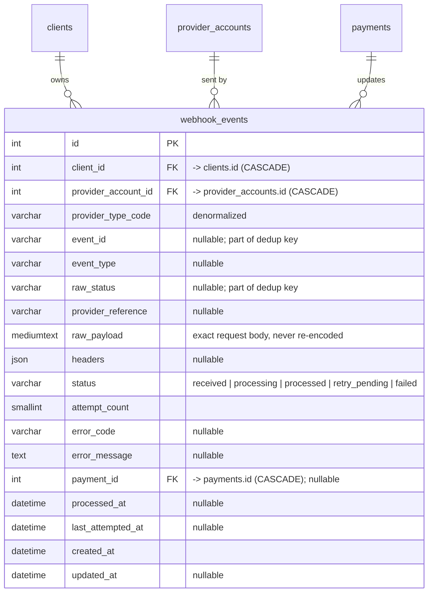
```mermaid
erDiagram
    webhook_events {
        int id PK
        int client_id FK "-> clients.id (CASCADE)"
        int provider_account_id FK "-> provider_accounts.id (CASCADE)"
        varchar provider_type_code "denormalized"
        varchar event_id "nullable; part of dedup key"
        varchar event_type "nullable"
        varchar raw_status "nullable; part of dedup key"
        varchar provider_reference "nullable"
        mediumtext raw_payload "exact request body, never re-encoded"
        json headers "nullable"
        varchar status "received | processing | processed | retry_pending | failed"
        smallint attempt_count
        varchar error_code "nullable"
        text error_message "nullable"
        int payment_id FK "-> payments.id (CASCADE); nullable"
        datetime processed_at "nullable"
        datetime last_attempted_at "nullable"
        datetime created_at
        datetime updated_at "nullable"
    }

    clients ||--o{ webhook_events : "owns"
    provider_accounts ||--o{ webhook_events : "sent by"
    payments ||--o{ webhook_events : "updates"
```

`UNIQUE (provider_account_id, event_id, raw_status)` is the dedup key (Q2) — `raw_status` is
included because Mollie's webhooks reuse the payment id as `event_id` for every status change on
that payment, so `event_id` alone would silently drop every change after the first. Store →
process is split but happens in the same HTTP request (Q3, user-specified): the row is inserted
with the parsed fields already populated (or all `null` if the signature failed to verify), then
`ProcessWebhookEventHandler` runs inline. Webhooks only ever update an **existing** `payments` row
(Q1) — never create one; a webhook resolving to a checkout attempt with no payment yet is left
`retry_pending`. `webhook:retry-pending` (`src/Jobs/RetryPendingWebhookEvents.php`, cron-invoked)
reuses the identical processor for anything left `received`/`retry_pending`, until `attempt_count`
reaches the code constant `MAX_ATTEMPTS` (`5`). The HTTP response is always `200` once stored and
verified, regardless of the inline processing outcome (Q4) — the cron job is the sole retry path,
never the provider's own redelivery. `POST /api/v1/webhooks/{provider}/{token}` (Q5) is public,
`{token}` (from `provider_account_endpoints`, Phase 9) resolves the account; `{provider}` is
logging-only. Full detail: `.claude/docs/database-design.md` → "Webhooks (Phase 25)".

## Subscriptions (Phase 26)

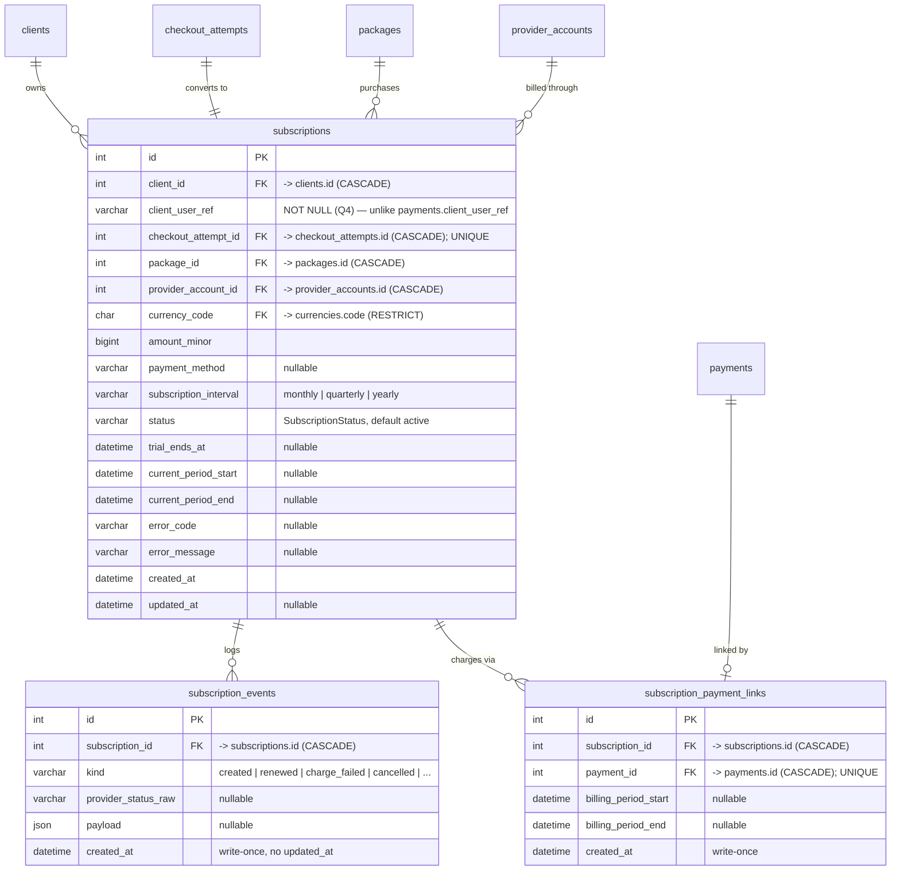
```mermaid
erDiagram
    subscriptions {
        int id PK
        int client_id FK "-> clients.id (CASCADE)"
        varchar client_user_ref "NOT NULL (Q4) — unlike payments.client_user_ref"
        int checkout_attempt_id FK "-> checkout_attempts.id (CASCADE); UNIQUE"
        int package_id FK "-> packages.id (CASCADE)"
        int provider_account_id FK "-> provider_accounts.id (CASCADE)"
        char currency_code FK "-> currencies.code (RESTRICT)"
        bigint amount_minor
        varchar payment_method "nullable"
        varchar subscription_interval "monthly | quarterly | yearly"
        varchar status "SubscriptionStatus, default active"
        datetime trial_ends_at "nullable"
        datetime current_period_start "nullable"
        datetime current_period_end "nullable"
        varchar error_code "nullable"
        varchar error_message "nullable"
        datetime created_at
        datetime updated_at "nullable"
    }
    subscription_events {
        int id PK
        int subscription_id FK "-> subscriptions.id (CASCADE)"
        varchar kind "created | renewed | charge_failed | cancelled | ..."
        varchar provider_status_raw "nullable"
        json payload "nullable"
        datetime created_at "write-once, no updated_at"
    }
    subscription_payment_links {
        int id PK
        int subscription_id FK "-> subscriptions.id (CASCADE)"
        int payment_id FK "-> payments.id (CASCADE); UNIQUE"
        datetime billing_period_start "nullable"
        datetime billing_period_end "nullable"
        datetime created_at "write-once"
    }

    clients ||--o{ subscriptions : "owns"
    checkout_attempts ||--|| subscriptions : "converts to"
    packages ||--o{ subscriptions : "purchases"
    provider_accounts ||--o{ subscriptions : "billed through"
    subscriptions ||--o{ subscription_events : "logs"
    subscriptions ||--o{ subscription_payment_links : "charges via"
    payments ||--o| subscription_payment_links : "linked by"
```

A subscription is created from exactly one confirmed `checkout_attempts` row (Q1, `UNIQUE
(checkout_attempt_id)`) — reusing the same Checkout pipeline a one-time payment uses, so every
package/country/provider/method/client-config subscription-capability guard is already enforced
before `CreateSubscriptionHandler` runs. No `country` column: a direct mid-phase user correction
("skip the country column for now"), not a Q1-Q4 decision — a handler that needs a subscription's
country (`RecordSubscriptionPaymentHandler`, building a `Payment`) reads it from
`checkout_attempts.country` via `checkout_attempt_id` instead. `payment_method` is nullable, also
a direct correction. `client_user_ref` is the one mandatory field (Q4) where `Subscriptions`
diverges from `payments`' nullable precedent — CLAUDE.md's Subscription Ownership Model requires
a known owner for every subscription. Lifecycle (`SubscriptionStatus`): `trialing`/`active` ↔
`past_due` → `cancelled` (terminal) — an explicit allowed-next-statuses graph, the same pattern
`PaymentStatus` established, since active↔past_due can cycle. `subscription_payment_links` (Q2)
is the explicit join answering "which payments belong to this subscription" — a renewal charge is
a real `payments` row with `checkout_attempt_id = NULL`, linked here instead; `UNIQUE (payment_id)`
means a payment belongs to at most one subscription. Example: a client user on a monthly Pro
subscription whose card is declined on renewal gets a new `payments` row (`status = failed`) plus
a `subscription_payment_links` row tying it to their subscription, a `subscription_events` row
(`kind = charge_failed`), and their subscription's own `status` moves to `past_due` — all without
touching `checkout_attempts` at all, since no new checkout ever happened. Full detail:
`.claude/docs/database-design.md` → "Subscriptions (Phase 26)".
